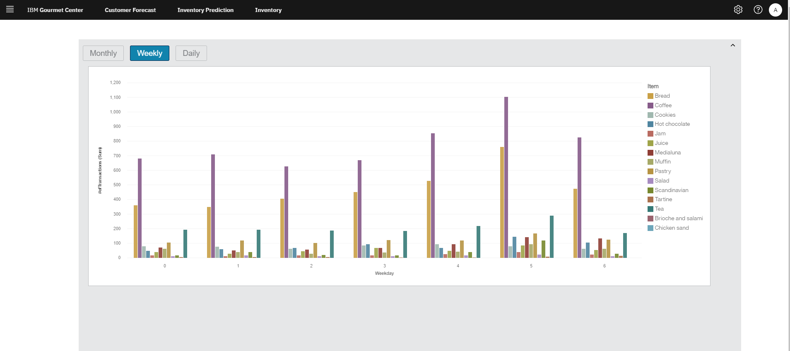

#  Smart Food Saver 
## Team Name: swatswat-37-intern-hack-19
Abdul El-Rahwan,
Andrew Jaramillo,
Alexander Mah,
Bailey Duncan,
Derek Roy,
Gillian Cai,
Harnoor Manan

### Architecture

### Tech Stack
- React Frontend
- Watson Studio + SPSS Modeller
- Db2
- IBM The Weather Company API
- Cognos Analytics (Dashboard)

### Customer Traffic Forecasting with AI

### Inventory Db2 Integration with Inventory Order Recommendation

### Monthly, Weekly, Daily Item Sale Predictions

